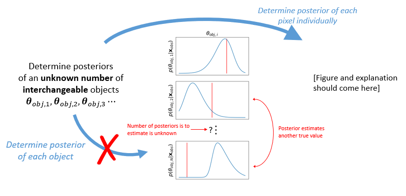

# _Pirates_

With PIxel RATio ESimation (_pirates_), one can the posteriors of an arbitrary number of interchangable objects from multi-dimensional images. It is built upon [swyft](https://github.com/undark-lab/swyft) using Truncated Marginal Neural Ratio Estimation (TMNRE).

Do you want to **estimate the posterior of an unknown number of interchangeable objects**? Then *pirates* might help you, because it:
- determines the *pixel posterior probability* of an object being in a user-defined pixel.
- performs likelihood-free inference by estimating the likelihood-to-evidence ratio using TMNRE.
- validates the results.



### Setup
```bash
pip install pirates
```

### Tutorial
Imagine you have a simulator that produces 3 dimensional data `data` representing the intensity in space  with objects that are described by . One can let *Pirates* estimate the posterior of an object in a pixel .
```python
pir.train(data, theta, data_dims = [0, 1], theta_dims = [0, 1, 2], dims = dict('x'=80, 'y'=80, 'M'=12)
```
The network projects the posterios on a hypercube with resolution .

### Links
* **Documentation & installation**: https://pires.readthedocs.io/en/latest/
* **Example usage**: https://pires.readthedocs.io/en/latest/tutorial-notebooks.html
* **Source code**: https://github.com/elidub/pires
* **Support & discussion**: https://github.com/elidub/pires/discussions
* **Bug reports**: https://github.com/elidub/pires/issues
* **Contributing**: https://pires.readthedocs.io/en/latest/contributing-link.html
* **Citation**: https://pires.readthedocs.io/en/latest/citation.html


